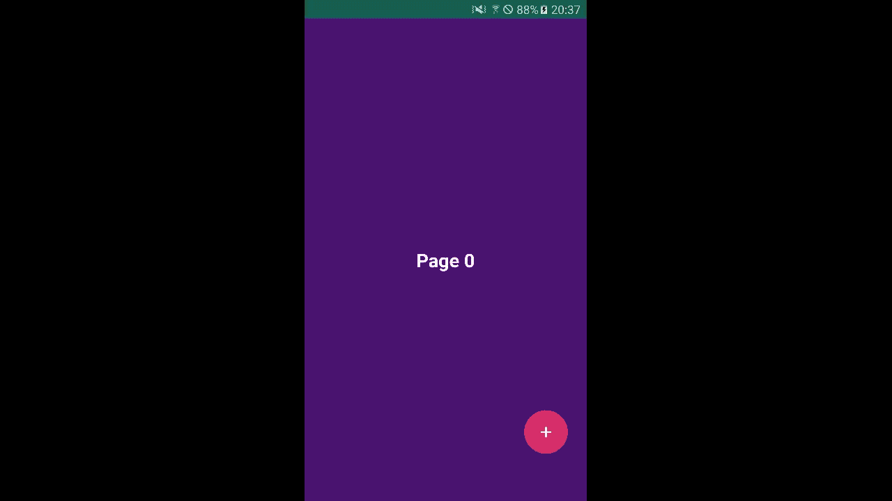

# Android ViewPager2 simple example app
This is an example app that implements ViewPager2. 
Press (+)button to add a random-colored page.
## Getting Started
This sample uses the Gradle build system. To build this project, use the "gradlew build" command or use "Import Project" in Android Studio.

## Demo

